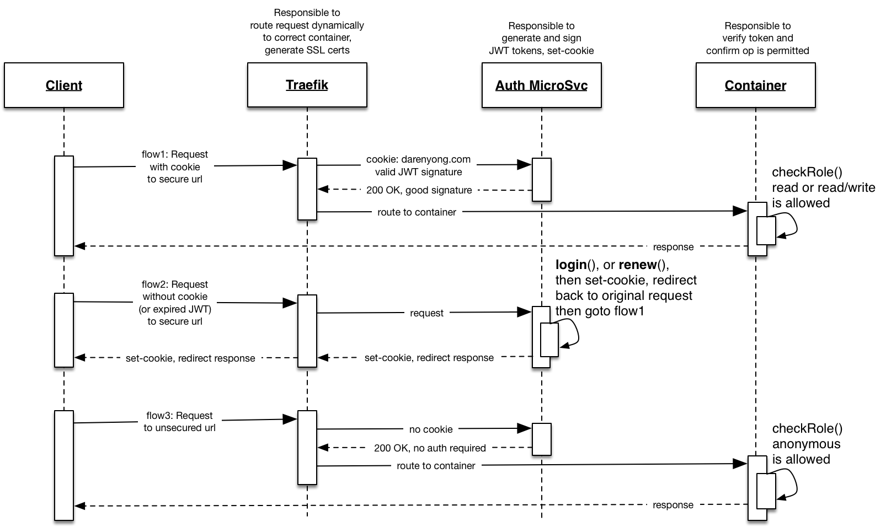

# https://darenyong.com

A personal web site (hosted VPS) built on CentOS 7,
using Docker containers, [Traefik](https://traefik.io) reverse proxy,
with MongoDB on the backend, and ||something|| for front-end.

Hosting provider: [Hostigger.com](https://www.hostigger.com/virtual-private-servers) (Chicago Data Center)

Great price at $2.99 USD/mo (for 1 vCPU, 2 GB Ram, 20 GB SSD, 2TB bandwidth)

[web dashboard](http://darenyong.com:44444/dashboard/#/health) (password protected)

## Personal repos used
* [traefik](https://github.com/darenyong/traefik)
(reverse proxy providing SSL and routing to containers)
* [auth](https://github.com/darenyong/auth)
(auth microservice for generating JWT tokens)
* [hello-world](https://github.com/darenyong/hello-world/tree/develop)
(simple demo app connected to MongoDB)

## Overview

  

## Auth Sequence Diagram

  

## Todo List
* Configure Jenkins CI to be able to auto-deploy
latest code on commit & unit test pass.
* Create Jenkins task to run traefik container with one click.
* Monitoring of Host, containers, and Traefik using Prometheus and Grafana
stolen from [here](https://www.brianchristner.io/updated-docker-monitoring-prometheus-grafana/).
* Play with mild CSS animations for web front-end.
* Android mobile app (play with React Native).
* iOS mobile app (Swift).
